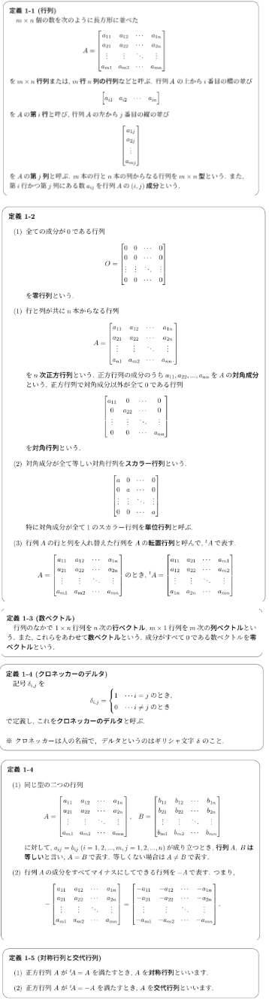
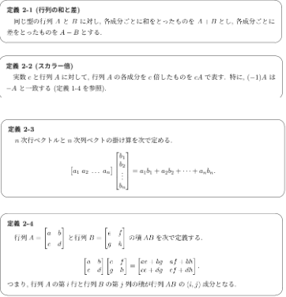
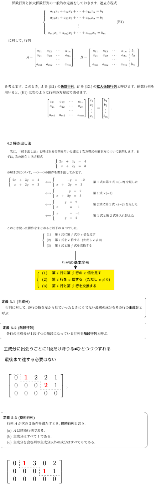

# 線形代数

https://math-notes.info/li/

# 行列の演算

## 要素

定義1

| 用語                 | イメージ                                                                |
| :------------------- | :---------------------------------------------------------------------- |
| 行列                 | ルール（変換・対応表）                                                  |
| 零行列               | 入力をどう組み合わせても常に0しか出さない。( × 0)                       |
| n次正方行列          | 同じ種類の量を n 個 → n 個へ変換するルール                              |
| 対角成分             | 各要素が自分自身にどれだけ影響するか                                    |
| 対角行列             | 各成分を独立に倍率変更するだけのルール                                  |
| スカラー行列         | 全成分を同じ倍率で一括スケールするルール ( × k)                         |
| 単位行列             | 何も変えない“そのまま通す”ルール ( × 1)                                 |
| 転置行列             | 関係の向きを入れ替える（「誰→何」⇔「何←誰」）                           |
| クロネッカーのデルタ | 一致判定のスイッチ（一致なら1、違えば0）                                |
| 対称行列             | 相互関係が“行き＝帰り”で同じな関係表。                                  |
| 交代行列             | 向きを持つ相互作用（A→B と B→A が符号反転する）＝循環・回転っぽい関係。 |

## 性質

- 可換性
  - $ A + B = B + A $ は成り立つが $ AB = BA $ が成り立つとはかぎらない
  - $ AB = BA $ が成り立つ場合はAとBは可換であるという
  - 影響 : 処理の順序が意味を持つ(例：回転→拡大 と 拡大→回転 は結果が変わる)
- 零因子: 零行列ではないのにABが零行列になるときのA,Bを指す
  - 影響 : 情報があるのに、組み合わせると完全に消える現象が起こり得る
- べき零行列: 何乗かすると零行列になる行列
  - 影響：繰り返し適用すると必ず消えるモードを示せる
- 結合法則
  - $ (A+B)+C=A+(B+C) $ と $ (AB)C=A(BC) $ は成り立つ
  - 影響：掛け算の“括り方”だけ自由に変えられるので、計算手順を最適化できる。
- 分配法則
  - $ A(B+C)=AB+AC (A+B)C=AC+BC$ は成り立つ
  - 影響:モデルの分解、実装の共通化、微分・最適化・線形回帰などの式変形がやりやすい
- 転置と演算の関係
  - $ (A + B)^T = A^T + B^T $
  - $ (AB)^T = B^T A^T $ ※AとBが逆順
  - 影響：向き（行/列、入力/出力、関係の矢印）を反転した世界でも整合した計算ができる。

## 操作

定義2

- 足し算・スカラー倍：効果を足す / 強さを調整する
- 行列 × 行列 ：「ルールを合成して“ひとつのルール”にまとめる」

# 掃き出し法

## 要素

定義1

| 用語           | イメージ                                                       |
| :------------- | :------------------------------------------------------------- |
| 係数行列       | ルール本体                                                     |
| 定数項ベクトル | 達成したい目標値                                               |
| 拡大係数行列   | ルールと目標を一枚にした伝票                                   |
| 掃き出し法     | 条件（方程式）を同値なまま整理して、答えが見える形にする手順。 |
| 行列の基本変形 | 式を壊さずに形だけ変える許される操作                           |
| 階段行列       | 段々に整理された中間形                                         |
| 簡約行列       | 答えが“ほぼそのまま読める最終形”                               |
| 階数(ランク)   | 独立な情報（独立な条件/独立な軸）の本数                        |

## 性質

- 簡略行列
  - 行列は基本変形を繰り返すことで簡約行列に変形できる(行列の簡約化)
  - 与えられた行列を簡約化する過程はいろいろあるが,最終結果はただ一通り
- rank
  - Aがm×n型行列ならば $ rank(A)≦m, rank(A)≦n. $
  - 影響：同じ問題を“同じ形”に正規化でき、実装・監査・比較が可能になる。
  - n変数の連立一次方程式 $ [A\mid \vec{b}] $ を考える
    - $ rank(A) = rank ([A\mid \vec{b}]) = n $ ならただ 1 つの解をもつ
    - 影響：推定・計画・復元が「決まる」
    - $ rank(A) < rank ([A\mid \vec{b}]) $ なら解を持たない
    - 影響：入力条件が矛盾している（同時に満たせない）
    - $ rank(A) = rank ([A\mid \vec{b}]) < n $ なら無限個の解を持つ
    - 影響：条件が足りず、自由度が残る（=選べる）
